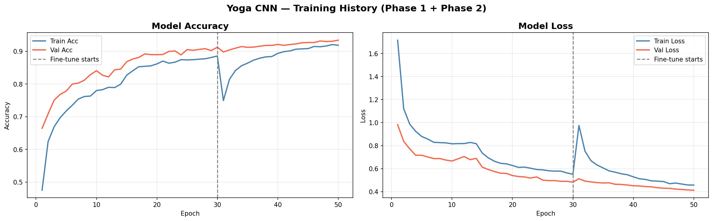
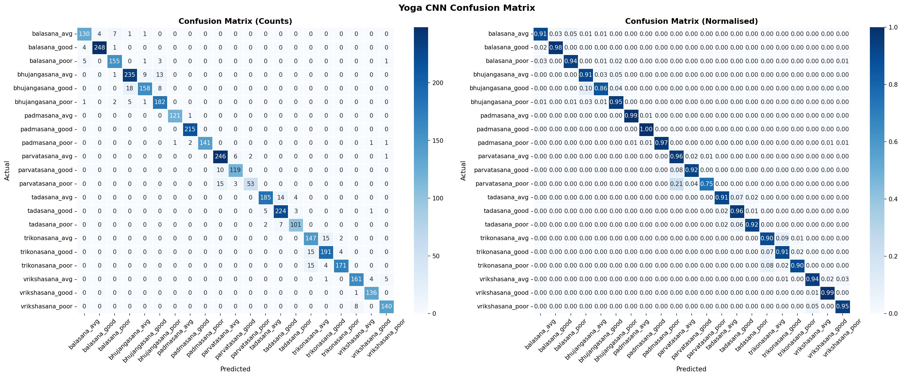
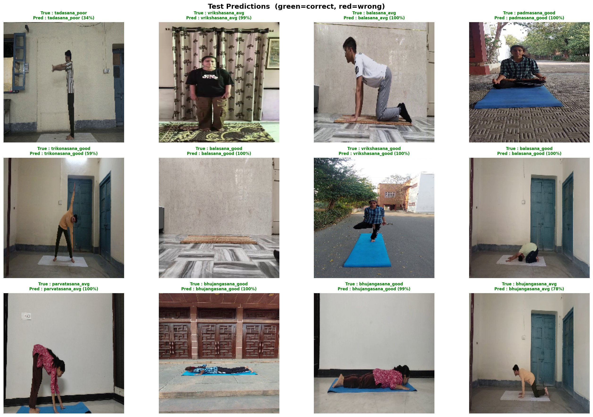

# 🧘 Yoga Pose Classification — CNN (MobileNetV2)

A deep-learning system that classifies **7 yoga poses** and their **execution quality** (Good / Average / Poor) directly from images using **Transfer Learning** on MobileNetV2 — no joint detection required.

> **Final Year Project — B.Tech / MCA (Computer Science)**  
> Trained on Kaggle with NVIDIA Tesla T4 GPU · **93.54% test accuracy**

---

## 📌 Table of Contents
- [Overview](#overview)
- [Why CNN over MediaPipe + Random Forest?](#why-cnn-over-mediapipe--random-forest)
- [Demo](#demo)
- [Features](#features)
- [Dataset](#dataset)
- [Model Architecture](#model-architecture)
- [Results](#results)
- [Project Structure](#project-structure)
- [Installation](#installation)
- [Usage](#usage)
- [Augmentation](#augmentation)
- [Future Work](#future-work)
- [Acknowledgements](#acknowledgements)
- [License](#license)

---

## Overview

This project builds an end-to-end CNN pipeline that:

1. **Extracts** frames from yoga video clips (1 fps via OpenCV)
2. **Trains** a MobileNetV2-based classifier in two phases (feature extraction → fine-tuning)
3. **Evaluates** with accuracy, F1, confusion matrix, and sample prediction grids
4. **Infers** on new images, video files, or a live webcam with colour-coded HUD feedback

The same dataset (472 videos, 7 poses, 3 quality levels) was used to train a companion MediaPipe + Random Forest model. This CNN repo is the **bonus / comparative** submission.

---

## Why CNN over MediaPipe + Random Forest?

| Aspect | MediaPipe + Random Forest | CNN — MobileNetV2 (this repo) |
|--------|--------------------------|-------------------------------|
| Input | 33 body keypoints | Raw pixels (224 × 224) |
| Joint detection required | ✅ Yes | ❌ No |
| Occlusion handling | ❌ Poor | ✅ Better |
| Learns texture/background | ❌ No | ✅ Yes |
| Interpretability | High | Lower |
| Computation (training) | Low | High (GPU recommended) |
| Test accuracy | ~93.14% | **93.54%** |

---

## Demo

### Training Curves (Phase 1 + Phase 2 Fine-Tuning)



### Confusion Matrix



### Sample Test Predictions



### Real-Time Webcam HUD

| Colour | Meaning |
|--------|---------|
| 🟢 Green bar | Good quality |
| 🟡 Yellow bar | Average quality |
| 🔴 Red bar | Poor quality |

---

## Features

- **No keypoint detection** — model learns directly from raw image pixels
- **Transfer Learning** — MobileNetV2 backbone pre-trained on ImageNet
- **Two-Phase Training** — frozen feature extraction then partial fine-tuning
- **Data Augmentation** — horizontal flips, brightness jitter, random rotations
- **Smoothed real-time inference** — 5-frame majority-vote buffer for stable webcam output
- **Colour-coded HUD** with live pose correction tips
- **TFLite export** — lightweight model for mobile / edge deployment
- **CLI scripts** — `yoga_webcam.py` and `predict.py` for inference outside the notebook

---

## Dataset

**472 videos · 7 poses · 3 quality levels → 2,652 extracted frames**

Dataset source: [`khushwantmehra/yoga-video-dataset`](https://www.kaggle.com/datasets/khushwantmehra/yoga-video-dataset) on Kaggle

### Yoga Poses

| Pose | Sanskrit Name |
|------|--------------|
| Child's Pose | Balasana |
| Cobra Pose | Bhujangasana |
| Lotus Pose | Padmasana |
| Mountain Pose (seated) | Parvatasana |
| Mountain Pose (standing) | Tadasana |
| Triangle Pose | Trikonasana |
| Tree Pose | Vrikshasana |

### Quality Levels
- **Good** — correct pose execution
- **Avg** — moderate quality, minor corrections needed
- **Poor** — incorrect execution, significant corrections needed

### Directory Structure

```
Final_project3_dataset/
├── balasana/
│   ├── good/      ← .mp4 video files
│   ├── avg/
│   └── poor/
├── bhujangasana/
│   └── ...
└── ...  (same structure for all 7 poses)
```

> **Note:** The dataset is not included due to size. Download from Kaggle and place it at `Final_project3_dataset/` before training.

---

## Model Architecture

```
Input Image (224 × 224 × 3)
         │
         ▼
 MobileNetV2 Backbone
 (ImageNet weights, 2.26M params)
         │
         ▼
 GlobalAveragePooling2D
         │
         ▼
 BatchNormalization
         │
         ▼
 Dense(512, relu) + L2
         │
         ▼
 Dropout(0.4)
         │
         ▼
 Dense(256, relu) + L2
         │
         ▼
 Dropout(0.3)
         │
         ▼
 Dense(21, softmax)
 ← 7 poses × 3 quality levels →
```

### Parameter Count

| Layer | Output Shape | Params |
|-------|-------------|--------|
| Input | (None, 224, 224, 3) | 0 |
| MobileNetV2 | (None, 7, 7, 1280) | 2,257,984 |
| GlobalAveragePooling2D | (None, 1280) | 0 |
| BatchNormalization | (None, 1280) | 5,120 |
| Dense 512 | (None, 512) | 655,872 |
| Dropout | (None, 512) | 0 |
| Dense 256 | (None, 256) | 131,328 |
| Dropout | (None, 256) | 0 |
| Dense 21 | (None, 21) | 5,397 |

### Training Strategy

**Phase 1 — Feature Extraction** (backbone frozen)
- LR: `1e-3` · Epochs: up to 30 · Early stopping patience: 8

**Phase 2 — Fine-Tuning** (last 30 backbone layers unfrozen)
- LR: `1e-5` · Epochs: up to 20 additional · Early stopping patience: 10

**Callbacks:** `ModelCheckpoint`, `EarlyStopping`, `ReduceLROnPlateau`

---

## Results

| Metric | Score |
|--------|-------|
| **Test Accuracy** | 93.54% |
| **Precision (weighted)** | 93.65% |
| **Recall (weighted)** | 93.54% |
| **F1 Score (weighted)** | 93.52% |

*Training environment: Kaggle Notebook · NVIDIA Tesla T4 GPU*

---

## Project Structure

```
yoga-pose-cnn/
│
├── yoga-cnn.ipynb              # Full training pipeline (notebook)
├── yoga_webcam.py              # Real-time webcam inference script
├── predict.py                  # CLI: predict on image or video file
├── classes.txt                 # 21 class labels (one per line)
├── requirements.txt            # Python dependencies
├── README.md                   # This file
├── LICENSE
├── .gitignore
│
├── assets/                     # Result images (committed to repo)
│   ├── training_history.png
│   ├── confusion_matrix.png
│   └── test_predictions.png
│
│   ── Generated after training (gitignored) ──
├── yoga_cnn_model.h5           # Trained Keras model
├── yoga_cnn_model.tflite       # TFLite export
├── label_encoder_cnn.pkl       # Scikit-learn LabelEncoder
└── frames_cnn/                 # Extracted frames (2,652 images)
```

---

## Installation

### Prerequisites
- Python 3.8+ (3.10 recommended)
- GPU with CUDA strongly recommended for training; CPU is fine for inference

### Steps

```bash
# 1. Clone the repository
git clone https://github.com/<your-username>/yoga-pose-cnn.git
cd yoga-pose-cnn

# 2. Create and activate a virtual environment
python -m venv venv

# Windows
venv\Scripts\activate
# Linux / macOS
source venv/bin/activate

# 3. Install dependencies
pip install -r requirements.txt
```

---

## Usage

### 1 — Train the Model

Place your dataset at `Final_project3_dataset/` then open the notebook:

```bash
jupyter notebook yoga-cnn.ipynb
```

Run all cells top-to-bottom. The notebook will:
- Extract frames from videos → `frames_cnn/`
- Build and train the MobileNetV2 CNN (Phase 1 + Phase 2)
- Evaluate on the held-out test set and plot results
- Save `yoga_cnn_model.h5`, `yoga_cnn_model.tflite`, `label_encoder_cnn.pkl`, `classes.txt`

### 2 — Real-Time Webcam Detection

```bash
python yoga_webcam.py

# Use external/USB camera
python yoga_webcam.py --camera 1
```

Press **Q** to quit · **S** to save a screenshot.

### 3 — Predict on an Image or Video

```bash
# Image
python predict.py --input your_photo.jpg

# Video
python predict.py --input your_video.mp4
```

**Sample output:**
```
====================================================
  Pose        : Vrikshasana
  Quality     : Good
  Confidence  : 99.0%

  Tip: Excellent balance!
====================================================
```

### 4 — Load the Model in Your Own Code

```python
import tensorflow as tf
import joblib
import numpy as np
import cv2

model = tf.keras.models.load_model("yoga_cnn_model.h5")
le    = joblib.load("label_encoder_cnn.pkl")

# Preprocess: resize to 224×224, normalise to [0, 1]
img   = cv2.cvtColor(cv2.imread("pose.jpg"), cv2.COLOR_BGR2RGB)
img   = cv2.resize(img, (224, 224)).astype(np.float32) / 255.0

probs = model.predict(img[np.newaxis], verbose=0)[0]
label = le.classes_[np.argmax(probs)]  # e.g. "trikonasana_good"
print(label)
```

---

## Augmentation

Applied **only during training** via a custom `YogaDataGenerator`:

| Technique | Detail |
|-----------|--------|
| Horizontal flip | 50% probability |
| Brightness jitter | Random factor in [0.8, 1.2] |
| Rotation | Random 0°, 90°, or 270° |

---

## Future Work

- [ ] Live webcam demo deployed as a Streamlit / Gradio web app
- [ ] Expand to 15+ yoga poses
- [ ] LSTM / Transformer over keypoint sequences for temporal modelling
- [ ] On-device inference via TFLite on Android / iOS
- [ ] Hybrid model — CNN features + MediaPipe keypoints fused

---

## Acknowledgements

- [MobileNetV2](https://arxiv.org/abs/1801.04381) — Sandler et al., Google
- [TensorFlow / Keras](https://www.tensorflow.org/) — training framework
- [OpenCV](https://opencv.org/) — video capture and frame processing
- [Kaggle](https://www.kaggle.com/) — GPU training environment (Tesla T4)
- Dataset curated by **Khushwant Mehra**

---

## License

Released under the [MIT License](LICENSE).
